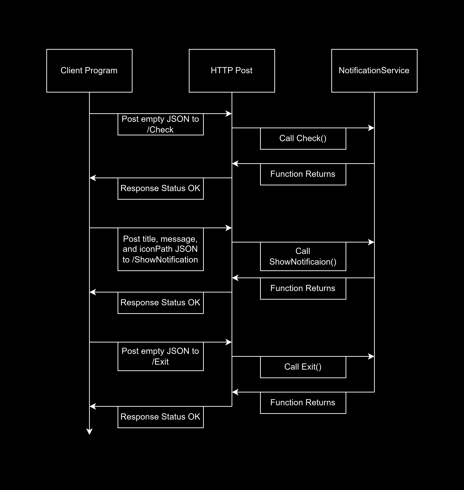

# NotificationService
Notification Service is a Windows 10 and 11 executable microservice for displaying notifications.
The general workflow when using NotificationService is to first launch NotificationService.exe with the desired command line arguments
then send request with HTTP post.

# Command Line Args
USAGE: NotificationService.exe [/port:12345]

If the argument /port is provided then the custom port will be used.
If Notification Service fails to bind to the specified port or if the specified port is invalid then an error will be printed to the console and the process will exit with status code 0.
If Notification Service successfully binds to the specified port then the microservice will run until sent the exit command at which moment it will exit with status code 0.

If the argument /post is not provided then a random free port will be used.
Notification Service will find a free port and restart itself with that port as an argument.
The original parent process will exit with a status code which is the same as the found port.
For example if NotificationService.exe returns exit code 12345 when launched without the /port argument this means the server is now running in a new process on port 12345.

# Functions
Each function is called by sending a JSON packet with the specified arguments to a given endpoint.
If there are no input arguments then an empty JSON object should be used {}.
For example to call the ShowNotification function I would HTTP post the following JSON to http://localhost:port/ShowNotification
{
	"title":"Example Notificaion",
	"message":"Hello World This Is A Notificaion!",
	"iconPath":"C:\Users\Me\Desktop\Icon.png"
}
NotificationService.exe would then respond with a JSON status in the following form:
{
	"status":"OK"
}
Or if the function failed the response JSON might look like this:
{
	"status":"Unable to show notification because access was denied"
}

# Check
The check function always returns status OK as long as NotificationService.exe is running.
It is used to check that you have the correct port and that NotificationService.exe is running properly.
Inputs:
	None
Outputs:
	string status // Either OK or an error message

# Exit
The exit function instructs NotificationService.exe to exit after this request.
After sending this request no other requests may be sent.
Inputs:
	None
Outputs:
	string status // Either OK or an error message

# ShowNotification
The ShowNotificaion function sends the user a windows notification.
Inputs:
	string title // The title of the notification.
	string message // The body aka message of the notification.
	string iconPath // A fully rooted path to a PNG or JPEG to be used as the notification's icon
Outputs:
	string status // Either OK or an error message

# UML Sequence Diagram

# Mitigation Plan
For which teammate did you implement "Microservice A"?
I (Finlay Christ) implamented Microservice A for Michael Louard.

What is the current status of the microservice? Hopefully, it's done!
It is completely done with all features working.

If the microservice isn't done, which parts aren't done and when will they be done?
I beleive that everything is done, however, I am happy to swing back and fix bugs as they are discovered.

How is your teammate going to access your microservice? Should they get your code from GitHub (if so, provide a link to your public or private repo)? Should they run your code locally? Is your microservice hosted somewhere? Etc.
My microservice is availible in two forms. Either as a portable windows executable (.exe) or as C# source code which can be compiled manually.
Both are hosted on my public GitHub repo: [https://github.com/RandomiaGaming/NotificationService](https://github.com/RandomiaGaming/NotificationService)

If your teammate cannot access/call YOUR microservice, what should they do? Can you be available to help them? What's your availability?
Our team has had great communication over Discord. I will continue to be availible for integration questions via our Discord group chat and I will reply to pings within 24 hours.

If your teammate cannot access/call your microservice, by when do they need to tell you?
As soon as you discover an issue with accessing or calling my microservice feel free to send me a ping on Discord. I may not reply to non-pings as quickly so please send me a ping.

Is there anything else your teammate needs to know? Anything you're worried about? Any assumptions you're making? Any other mitigations / backup plans you want to mention or want to discuss with your teammate?
I have tried my best to create a microservice which will be easy to integrate with since it uses http post and json which are easily accessible in many programming languages.
I hope that integration will be a smooth process and if not I am happy to assist in any way I can.